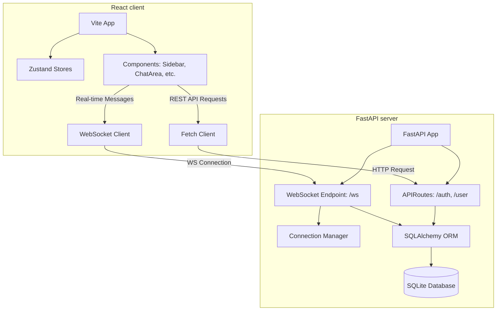

# 💬 ChatApp - Full Project Documentation

A full-stack, real-time messaging application designed with a sleek, minimalist high-contrast dark theme. The project features a high-performance **FastAPI** backend with SQLite database persistence and a modern **React + Vite** frontend utilizing **Tailwind CSS v4** and **Zustand** state management.

---

## 🏗️ System Architecture

The project is structured as a monorepo containing two main components:
1. **`/server`**: FastAPI Python backend dealing with REST APIs, authentication, SQLite (via SQLAlchemy ORM), and real-time communication via WebSockets.
2. **`/client`**: React single-page application built on Vite, styled with Tailwind CSS v4, managing state via Zustand, and communicating with the server via Fetch and WebSockets.



---

## 📂 Codebase Directory Structure

```
Chatapp/
├── client/                 # Frontend React Application
│   ├── src/
│   │   ├── assets/         # Images, fonts, and global assets
│   │   ├── components/     # Reusable React components
│   │   │   ├── ChatArea.jsx    # Real-time timeline & message input
│   │   │   ├── Login.jsx       # Login form with feedback
│   │   │   ├── Logo.jsx        # Branding logo component
│   │   │   ├── Navbar.jsx      # Navigation bar
│   │   │   ├── Register.jsx    # Registration form
│   │   │   ├── Sidebar.jsx     # Active contact list & status indicators
│   │   │   └── WelcomeArea.jsx # Default state screen
│   │   ├── store/          # Zustand State Management
│   │   │   ├── chatStore.js       # Unread badges and last previews
│   │   │   ├── counterStore.js    # Count store
│   │   │   ├── peopleDataStore.js # Active user list
│   │   │   ├── toStore.js         # Active conversation recipient tracking
│   │   │   └── userdataStore.js   # Authenticated user session
│   │   ├── App.jsx         # Layout manager and Route Guard
│   │   ├── index.css       # Core stylesheet & custom animations
│   │   └── main.jsx        # App router and bootstrap
│   ├── package.json        # Frontend dependencies & scripts
│   └── vite.config.js      # Vite compilation configurations
│
└── server/                 # Backend Python Application
    ├── src/
    │   ├── auth/
    │   │   └── auth.py     # Password hashing & JWT generation/verification
    │   ├── database/
    │   │   ├── model.py    # SQLAlchemy database models
    │   │   └── setup.py    # SQLite engine and session configuration
    │   ├── routes/
    │   │   ├── auth_route.py      # Registration & authentication endpoints
    │   │   ├── message_route.py   # Historical message retrieval endpoints
    │   │   ├── websocket_config.py# Active connection mapping & utility
    │   │   └── websocket_route.py # WebSocket event-loop handler
    │   └── schema/
    │       ├── message.py  # Pydantic schemas for messages
    │       └── user.py     # Pydantic schemas for users
    ├── main.py             # Uvicorn entry point & CORS configuration
    ├── requirements.txt    # Python dependencies
    └── chat-app.db         # Local SQLite DB instance
```

---

## 🗄️ Database Schema & Models

The application uses SQLite as its primary database. Database operations are handled using SQLAlchemy's modern `Mapped` type notation.

### 1. `users` Table
Stores user profiles, credentials (hashed), and real-time status fields.

| Column | Type | Constraints / Defaults | Description |
| :--- | :--- | :--- | :--- |
| `id` | `Integer` | Primary Key, Index | Unique user identifier |
| `username` | `String` | Unique, Required | Selected account alias |
| `password` | `String` | Required | Hashed user password |
| `active_status` | `Boolean` | Default: `False` | True if the user has an active connection |
| `created_at` | `DateTime` | Default: `func.now()` | Account registration timestamp |

### 2. `messages` Table
Stores message exchange records between users.

| Column | Type | Constraints / Defaults | Description |
| :--- | :--- | :--- | :--- |
| `id` | `Integer` | Primary Key, Index | Unique message identifier |
| `sender_id` | `Integer` | ForeignKey(`users.id`) | ID of user sending message |
| `receiver_id` | `Integer` | ForeignKey(`users.id`) | ID of user receiving message |
| `content` | `String` | Required | Plaintext message content |
| `status` | `Integer` | Default: `0` | Message delivery status (`1` = Sent/Unread, `2` = Delivered/Read) |
| `created_at` | `DateTime` | Default: `func.now()` | Message timestamps |

---

## 🔌 API & WebSocket Specifications

### REST Endpoints

#### 1. Authentication
* **`POST /auth/register`**
  - **Request Body**: `RegisterRequest` (`username`, `password`)
  - **Response Model**: `RegisterResponse` (`id`, `username`, `created_at`)
  - **Behavior**: Verifies if username is unique. Hashes password using bcrypt, commits to DB, and returns new user object.
* **`POST /auth/login`**
  - **Request Form**: `OAuth2PasswordRequestForm` (`username`, `password`)
  - **Response Model**: `LoginResponse` (`access_token`, `token_type`, `username`, `id`)
  - **Behavior**: Validates user credentials. Generates and returns a JWT access token.

#### 2. User & Message Operations
* **`GET /user/retrieve/users`**
  - **Headers**: Authorization Bearer JWT Token
  - **Response Model**: `List[UserListResponse]`
  - **Behavior**: Retrieves a list of all registered users (excluding the authenticated requester) along with their current `active_status`.
* **`GET /user/retrieve/message?to_id=<recipient_id>`**
  - **Headers**: Authorization Bearer JWT Token
  - **Query Params**: `to_id` (Integer)
  - **Response Model**: `List[MessageRetrieveResponse]`
  - **Behavior**: Retrieves the full chronological message thread between the requester and the target recipient. Automatically updates the status of all incoming messages to `2` (Delivered/Read) in a single database transaction.

---

### WebSocket Endpoint (`ws://localhost:8000/ws`)

Establishes a persistent bi-directional connection between the active client and the backend server.

* **Connection Parameters**:
  - `from` (Query parameter, alias of sender user ID)
  - `to` (Query parameter, alias of recipient user ID)
  - *Example Connection URL*: `ws://localhost:8000/ws?from=1&to=2`

* **Handshake & Auth Checks**:
  1. The server queries the database to ensure both `from` and `to` user IDs exist. If not, it rejects the socket handshake with code `1008` (Policy Violation).
  2. If valid, the socket is accepted, and the active status of the connecting user (`from_id`) is updated to `True` in the database.
  3. The connection is registered inside the memory-cached `ConnectionManager` map.

* **Communication Event Loop**:
  - The client transmits raw message text over the socket.
  - The backend intercepts the raw text, evaluates whether the target recipient (`to_id`) is online (`active_status == True`), and assigns the appropriate status code:
    - **`2`** (Delivered/Read) if the recipient is online.
    - **`1`** (Sent/Unread) if the recipient is offline.
  - The message is saved to the SQLite database.
  - If the target user is currently connected to the server, the message is serialized and sent to their WebSocket connection as a JSON payload:
    ```json
    {
      "sender_id": 1,
      "message": "Hello!"
    }
    ```

* **Disconnection Handling**:
  - When the connection is broken (e.g. closing tab or navigating away), the server catches a `WebSocketDisconnect` exception.
  - The user's active status is immediately updated to `False` in the database.
  - The connection is safely removed from the `ConnectionManager`.

---

## 🎨 Frontend Design & Architecture

### Design Aesthetics & Typography
The client layout conforms to a rich, high-contrast dark theme using custom tailwind color variables:
* **Background Matte**: `#09090b` (Zinc-950)
* **Containers / Panels**: `#18181b` (Zinc-900)
* **Border Highlights**: `#27272a` (Zinc-800)
* **Active Accents**: `#f97316` (Safety Orange)
* **High-Readability Text**: `#f4f4f5` (Zinc-100)
* **Fonts**: Headers use **Outfit**, primary content uses **Inter**, and brand logos use **Black Ops One**.

---

### State Management (Zustand Stores)

1. **`userdataStore.js`**
   - Tracks authenticated user details: `username` and `user_id`.
   - Actions to update state on login, register, and clear on logout.
2. **`toStore.js`**
   - Tracks the active recipient ID: `to_id`.
   - Used to switch active conversation scopes. Setting `to_id` to `0` represents idle/welcome screen.
3. **`peopleDataStore.js`**
   - Manages the client-side list of users loaded from the `/user/retrieve/users` API call.
4. **`chatStore.js`**
   - Tracks unread message counts per contact (e.g., when messages arrive for a user who is not in the currently active viewport).
   - Manages last message previews shown in the sidebar.

---

### Component Overview

* **`App.jsx`**: Manages the main workspace wrapper. Uses a React effect to redirect unauthenticated users to `/` if no JWT token is stored. Implements a responsive split-pane layout:
  - *Desktop*: Sidebar visible on the left; Chat/Welcome area visible on the right.
  - *Mobile*: If a contact is selected (`to_id !== 0`), the ChatArea expands to take 100% width; if `to_id === 0`, the contact Sidebar takes 100% width.
* **`Sidebar.jsx`**: Displays a search bar, user contact list, and the active user's profile card. Contacts have:
  - *Pulsing Orange Dot*: If their `active_status` is `true` (updated via an 8-second polling cycle).
  - *Static Gray Dot*: If they are offline.
  - *Unread Badge*: Orange counter indicating unread incoming messages.
  - *Last message preview*: Text preview under the contact name.
* **`ChatArea.jsx`**: Handles active conversations. On mount or recipient swap:
  - Loads historical messages from the REST API.
  - Mounts a new WebSocket connection to synchronize real-time updates.
  - Triggers auto-scroll to the bottom of the timeline.
  - Groups messages by dates (e.g., "Today", "Yesterday").
  - Displays checkmarks: Single gray tick (Sent/Unread) and double orange ticks (Read/Delivered).
  - Integrates an emoji-picker popup for richer interactions.

---

## ⚙️ Configuration & Setup

### Prerequisites
* Python 3.8+
* Node.js 16+
* npm

### Step 1: Set Up Backend

1. Navigate to server folder:
   ```bash
   cd server
   ```
2. Set up virtual environment and install dependencies:
   ```bash
   # Windows
   python -m venv .venv
   .venv\Scripts\activate

   # macOS/Linux
   python -m venv .venv
   source .venv/bin/activate

   # Install requirements
   pip install -r requirements.txt
   ```
3. Create a `.env` file in the root of the `server/` directory:
   ```env
   DB_URL=sqlite:///./chat-app.db
   ```
4. Run the Uvicorn application (database schemas are built automatically on startup):
   ```bash
   uvicorn main:app --reload --host 0.0.0.0 --port 8000
   ```

---

### Step 2: Set Up Frontend

1. Navigate to the client folder:
   ```bash
   cd client
   ```
2. Install npm dependencies:
   ```bash
   npm install
   ```
3. Create a `.env` file in the root of the `client/` directory:
   ```env
   VITE_API_URL=http://127.0.0.1:8000
   ```
4. Start the development server:
   ```bash
   npm run dev
   ```
5. Build production bundle (Optional):
   ```bash
   npm run build
   ```

---

## 🚀 Running & Verification Plan

### Manual Verification Flow

To verify full functional flow (Auth, Real-time WebSockets, message statuses, and offline sync):
1. Start the backend server on port `8000`.
2. Start the frontend Vite dev server. Open two different browser instances (e.g. Chrome and Edge or Chrome Incognito) to:
   - `http://localhost:5173`
3. **Register / Login**:
   - Register a user named `Alice` on Window 1, and login.
   - Register a user named `Bob` on Window 2, and login.
4. **WebSocket Connection**:
   - In Alice's sidebar, Bob should display with a pulsing orange dot (active status is online).
   - In Bob's sidebar, Alice should also show online.
5. **Real-time Chatting**:
   - Click Bob in Alice's sidebar. This opens the ChatArea and establishes the active WebSocket connection.
   - Click Alice in Bob's sidebar.
   - Type and send a message from Alice. Bob should receive it instantly in the timeline. The sent message in Alice's timeline should immediately transition to double orange ticks (since Bob is online and actively focused on their chat).
6. **Notification and Offline States**:
   - Select another contact or deselect (go to WelcomeArea) on Bob's window.
   - Send a message from Alice. The message should display with a single gray tick in Alice's view (since Bob is online but not listening on that specific user channel). Bob's sidebar should display an orange badge showing `1` unread message and update the last message preview.
   - Close Bob's tab. In Alice's sidebar, Bob's online dot should transition to gray within 8 seconds (via the next status polling run).
